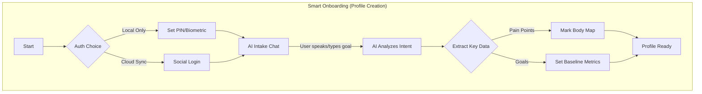

# Product Requirements Document (PRD): ChiroCard 2.0

## 1. Product Overview
**ChiroCard** is a "Universal Body Record" — a privacy-first, local-first Progressive Web App (PWA) that serves as a collaborative holistic health wallet between users and their bodywork practitioners (Chiropractors, Massage Therapists, PTs, Osteopaths).

**Meaning of "Chiro":** The prefix "Chiro-" comes from the Greek word *cheir*, meaning **"Hand"**. ChiroCard is for anyone who receives care from practitioners who use their hands to improve holistic body wellness.
**Brand Identity:** The logo features stylized **Hawaiian Lomi Lomi Hands**, symbolizing the healing touch and connection between practitioner and user.
> [!IMPORTANT]
> **Asset Protection:** The existing logo file at `/public/icon.svg` is the definitive brand asset. **Do not redesign, alter, or replace this file.** Use it exactly as is.

**Vision:** To empower individuals to own their holistic wellness data and facilitate seamless, data-driven communication with their care providers, without compromising privacy.

**Key Differentiator:** "Local-First" architecture ensuring zero-knowledge privacy, combined with on-device AI for personalized insights. This is a **User-Owned** record, distinct from medical records held by clinics.

## 2. Market Analysis & Need
*   **The Gap:** Current market solutions are dominated by "Practice Management Software" (for clinics to bill and track patients) or generic "Fitness Trackers" (steps/calories).
*   **The Need:** There is no dedicated "Personal Bodywork Record" for users to track their own progress across multiple modalities (massage, chiro, PT). Users currently rely on fragmented memory or notes.
*   **Opportunity:** A user-centric tool that bridges the gap between different holistic practitioners, ensuring the user is the central repository of their own body history.

## 3. Goals & Objectives
*   **Build a Robust PWA:** Create a high-performance, offline-capable web application that feels native on iOS and Android.
*   **Enhance Collaboration:** Streamline the "hand-off" experience between user (intake) and practitioner (session log).
*   **Visualize Wellness:** Move beyond text logs to visual body maps and trend charts.
*   **Leverage On-Device AI:** Use local LLMs (e.g., Gemini Nano via Chrome) to analyze trends and suggest maintenance protocols without sending data to the cloud.

## 4. Global Compliance & Privacy (Security by Design)
*   **Local-First Architecture:** Data is stored exclusively on the user's device (IndexedDB). No personal health information (PHI) is transmitted to cloud servers, ensuring inherent compliance.
*   **HIPAA (USA):** As a user-owned Personal Health Record (PHR) that does not transmit data to covered entities without user action, ChiroCard empowers users to share their own data. The app's architecture eliminates "Business Associate" liability.
*   **GDPR (Europe) & CCPA (California):**
    *   **Right to Access:** Users have instant, full access to their raw data.
    *   **Right to Erasure:** "Clear Data" instantly wipes the local database.
    *   **Data Portability:** JSON and PDF exports allow users to move their data freely.
*   **Encryption:** All local data is encrypted at rest.
*   **Non-Medical Device:** ChiroCard is a wellness tracking tool and does not provide automated medical diagnoses.

## 5. Target Audience
*   **Primary:** Individuals ("Users") who regularly see bodywork practitioners and want to track their holistic progress.
*   **Secondary:** Independent holistic practitioners who want to encourage clients to take ownership of their wellness journey.

## 6. Core Features

### 6.1. Authentication & User Accounts
*   **Local Protection:** PIN code or Biometric (FaceID/TouchID) to unlock the app locally.
*   **User Login (Optional):**
    *   **Account Creation:** Email/Password or Social Login (Google/Apple) to enable cloud features.
    *   **Purpose:** Enables encrypted cloud backup and multi-device sync.
    *   **Security:** Login credentials authenticate the user to the sync server, but data remains end-to-end encrypted (E2EE) using a separate key derived from the user's master password/PIN.
*   **Privacy Mode:** Auto-blur screen when app is backgrounded or inactive.

### 6.2. Dual-Mode Interface
*   **User Mode (The Owner):**
    *   **Smart Onboarding:** AI-assisted profile creation.
    *   **Digital Passport Profile:** A comprehensive medical snapshot designed for practitioners.
        *   **Biometrics:** Height, Weight, Age (Auto-calc), Activity Level (Sedentary to Athlete), Occupation.
        *   **Clinical Data:** Medical History (Surgeries/Accidents), Medications, Allergies, Mobility & ROM Status.
        *   **Primary Complaints:** (e.g., "Chronic Lower Back Pain", "Sciatica").
        *   **Contraindications:** (Red Alert: "No deep tissue on calves").
        *   **Preferences:** (Blue: "Lighter pressure", "Focus on neck").
    *   **Practitioner Management:** Maintain a list of practitioners.
    *   **Smart Scheduling & Homework:** Unified calendar for sessions and assigned exercises.
    *   **Dashboard:** "Gen Z" Bento Grid layout. High-contrast, dark mode aesthetic ("Bioluminescent Nature"). Quick view of current status, insights, and next actions.
    *   **Intake Form:** Simple check-in for body status.
    *   **History:** Timeline of past sessions.

*   **Practitioner Mode ("Guest Mode"):**
    *   **Concept:** A "Zero-Friction" experience.
    *   **Workflow:** User hands unlocked device to practitioner -> Practitioner views "Passport" -> Logs session -> Hands back.
    *   **"Holistic Health Passport" (Quick View):**
        *   **Purpose:** Instant context.
        *   **Visuals:** Color-coded cards for rapid scanning (Red=Danger, Amber=Focus, Blue=Info).
        *   **Vitals:** Immediate visibility of height/weight/activity level.
    *   **Session View:** Read-only view of intake.
    *   **Bodywork Log:** Interactive body map.

### 6.3. Simplified Body Region Selector
*   **Interface:** A clean, ordered list of labeled buttons representing body regions (Head to Toe, Front/Back).
*   **Organization:** Grouped logically (e.g., Head/Neck, Torso, Arms, Legs) to avoid clutter and ensure quick access.
*   **Interaction:** Tap a button (e.g., "Right Shoulder") to toggle status.
*   **Status Indicators:** Buttons change color to reflect status:
    *   ⚪️ **Normal** (Balanced)
    *   🔴 **Issue** (Tension/Discomfort)
    *   🟢 **Addressed** (Work done)
    *   🔵 **Watch** (Monitor for changes)

### 6.5. Session Validity & Security
*   **Session Locking:** Once a session is finalized by the practitioner, it becomes **immutable** (read-only) to preserve the integrity of the record.
*   **Digital Signatures:**
    *   **Mechanism:** Practitioners can sign the session record using a touchscreen signature pad or a unique PIN.
    *   **Validity:** This signature attests to the services rendered, acting as a "Proof of Treatment" for the user's personal records.
*   **PDF Export:**
    *   **Format:** Generate professional, SOAP-note style PDF reports of individual sessions or history.
    *   **Usage:** Users can print or share these PDFs with other providers or insurers as supplementary documentation.
    *   **Disclaimer:** The generated PDF includes a footer stating: *"This is a user-owned personal health record and may not replace the official legal medical record maintained by the provider."*

### 6.6. Data Management
*   **Local Storage:** Dexie.js (IndexedDB) for all data.
*   **Portable Records:** JSON Export/Import for backup; PDF for sharing.
*   **Encrypted Sync (Future):** Optional peer-to-peer sync or encrypted cloud backup.

### 6.5. AI "Body Architect"
*   **Session Summary:** Auto-generate a summary of the session based on logs.
*   **Protocol Generation:** Suggest stretches or exercises based on "Issue" areas.
*   **Trend Analysis:** "You tend to report neck tension after 3 weeks of no bodywork."

## 7. Technical Requirements
*   **Frontend Framework:** React 18 + Vite.
*   **Language:** TypeScript.
*   **Styling:** Tailwind CSS v4 (Mobile-first design).
    *   **Themes:** **Dual-Theme Support** (System Preference + Toggle).
        *   **Dark Mode ("Bioluminescent Nature"):** Deep Zinc-900/Black with glowing green plant veins.
        *   **Light Mode ("Morning Garden"):** Crisp White/Soft Grey with fresh green leaf textures.
    *   **Accents:** Emerald/Leaf Green (adaptive contrast).
    *   **Glassmorphism:** Frosted glass cards (Dark/Light variants).
*   **State Management:** React Context or Zustand.
*   **Database:** Dexie.js (IndexedDB).
*   **AI:** Chrome Built-in AI (window.ai) or fallback to lightweight WASM models.
*   **Icons:** Lucide React (plus original Lomi Lomi logo).
*   **Animation:** Framer Motion for smooth, organic transitions.

## 8. Visual Workflow

```mermaid
graph TD
    subgraph "User Mode (Intake)"
        A[Open App & Auth] --> B{Check-in}
        B -->|Log Status| C[Select Regions & Comfort Level]
        C --> D[Save Intake]
    end

    D --> E((Hand-off Device to Practitioner))

    subgraph "Practitioner Mode (Guest View)"
        E --> F[View 'Health Passport' (Summary)]
        F --> G[Perform Bodywork]
        G --> H[Log Actions (Tap Body Map)]
        H --> I[Voice-to-Text Notes]
        I --> J[Sign & Lock Record]
    end

    J --> K((Hand-off Device to User))

    subgraph "System (Record)"
        M --> N[Lock Session Record]
        N --> O[Update User History]
        O --> P[AI Generates Summary]
    end
```



## 9. User Flows

### Flow A: The Session
1.  **Check-in:** User opens app, authenticates, and fills out "Intake" (Comfort: 4/10, Location: Lower Back).
2.  **Hand-off:** User hands phone to Practitioner.
3.  **Bodywork:** Practitioner reviews intake, performs work, and taps "Lower Back" -> "Addressed". Adds note: "Tight psoas."
4.  **Plan:** Practitioner assigns "Cat-Cow stretch" as homework.
5.  **Finish:** Practitioner hands phone back. Session is locked to history.

### Flow B: Self-Care
1.  **Notification:** "Time for your stretches."
2.  **Action:** User opens app, checks off "Cat-Cow stretch".
3.  **Log:** User updates status of "Lower Back" from 🔴 to 🔵 (Watch).

## 9. Success Metrics
*   **Time to Log:** Intake should take < 30 seconds.
*   **Retention:** Users logging at least one session per month.
*   **Performance:** App loads in < 1 second (Lighthouse score > 90).
